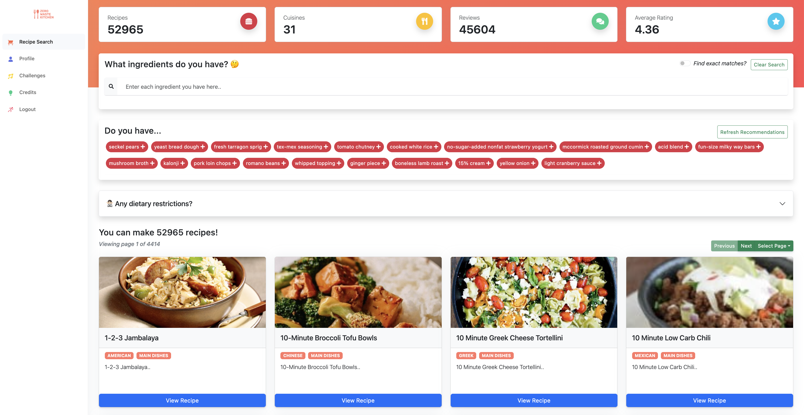
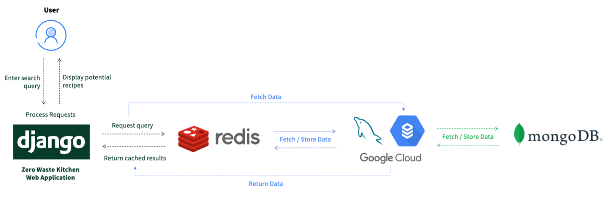
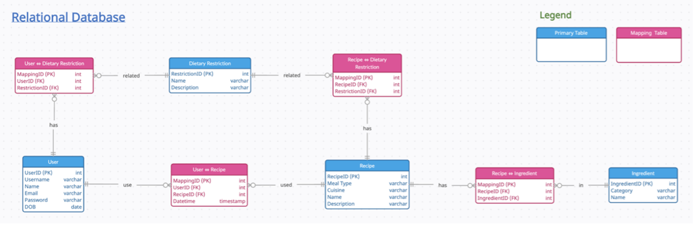
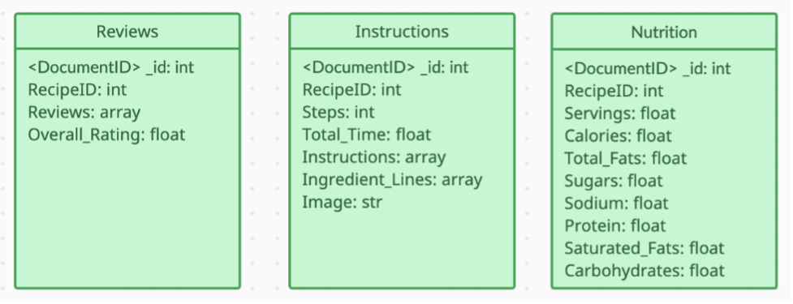
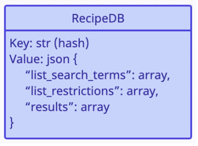

### INF2003 Database Systems Group 9: Zero Waste Kitchen
2200692 Pang Zi Jian Adrian <br>
2200959 Peter Febrianto Afandy <br>
2201014 Tng Jian Rong <br>
2201132 Lionel Sim Wei Xian <br>
2201159 Ryan Lai Wei Shao
### Project Overview
The "Zero Waste Kitchen" (ZWK) project aims to address the ongoing issue of household food wastage by providing users with a practical tool that empowers them to make efficient use of their kitchen ingredients, thereby reducing food waste. By offering personalized recipe recommendations collected and refined from large datasets like Yummy.com and Food.com, the ZWK project aims to encourage users to utilize their available ingredients more effectively. The project is implemented using a user-friendly web application, to provide convenience and quick access to users. 

By leveraging on database technologies and advanced queries, the application offers users a seamless experience to input their available ingredients and receive tailored recipe suggestions instantly. For further recipe refinements, the application supports a suite of advanced filtering options, such as by dietary restrictions and number of ingredients. This provides users with creative and exciting ways to utilise their existing ingredients, thereby promoting sustainable and mindful cooking practices. To encourage the platform’s usage amongst users, ZWK also allows users to track recipes that they have cooked, participate in recipe challenges, leave recipe reviews, and engage with a community of likeminded food enthusiasts.

### System Architecture
<u>Overview</u><br>
The ZWK project consists of a Django-based web application that serves as the primary interface for users to interact with the application, as well as a MySQL, MongoDB, and Redis database. The project builds on top of an existing Django template, Argon, to speed up development and focus the team’s efforts onto database operations. It is important to note that all SQL queries performed on the web application are implemented using raw SQL, even though Django provides its own ORM-model for queries. 



<u>Relational Database</u><br>
The MySQL relational database is used as the application’s main database to store atomic data, to allow for the correlation of information from its tables and the MongoDB collections. It includes tables such as Recipe, Dietary Restriction, Ingredient and User, as well as junction tables to represent the relationships between these tables after performing database normalisation on many-to-many relationships. 



<u>Non-Relational Database (MongoDB)</u><br>
A document-based MongoDB database is used for the ZWK application to store unstructured information that are diverse in nature, due to differences in the datasets obtained. It consists of three data collections, Recipe Instructions, Recipe Reviews and Recipe Nutrition. These data are selected to be stored in a document-based non-relational database due to their unstructured and diverse nature, and to provide scalability for future data additions. 



<u>Non-Relational Database (Redis)</u><br>
A key-value-based Redis non-relational database is used for caching. The Redis database is used to optimize the performance of recipe queries made by users, by saving the results of search queries and the search options entered. If the same search query and options are entered by a user, the ZWK application will fetch the results of the query from the Redis cache database, instead of querying the SQL database. The Redis database provides improved efficiency by enabling faster retrieval of previously accessed recipes, which is especially useful for popular searches.



### Submission Files
```
README.md (this file)

docs/ (images for documentation)

datasets/ (processed datasets obtained from the various data sources)

nosql/ (import files for the non-relational database)

sql/ (import files for the relational database)

web/ (main web application platform to deploy the ZWK project)

```
### Project Installation Instructions
---
The `web/` folder contains the main source code used to deploy the Zero Waste Kitchen application. Our application runs on Django, a Python-based web framework. Please ensure that your computing environment has Python installed. To run the application, follow the instructions below.

1. Change your current directory to the `web/` folder:
    ```
    cd web
    ```
2. Create a Python virtualenv on your local environment:
    ```
    python3 -m venv .venv
    ```

3. Activate your created virtualenv:
    ```
    source .venv/bin/activate
    ```

4. Download the application's required dependencies and libaries:
    ```
    pip3 install -r requirements.txt
    ```

5. Create a copy of the `.env_prod` file to `.env`, and update your settings (if any). It is recommended for you to connect to our **Cloud** databases as they have already been pre-configured for use. However, if you plan on setting up your own MySQL, MongoDB and Redis database servers, ensure that you have changed the connection details in your `.env` file! More instructions on how to set up and import the various datasets to your three local databases can be found [here](#full-database-setup).
    ```
    cp .env_prod .env
    ```

    For custom database configurations, ensure the following are modified in your `.env` file:
    ```
    DB_ENGINE=django.db.backends.mysql
    DB_NAME=<MySQL database schema>
    DB_HOST=<MySQL database host or domain>
    DB_PORT=<MySQL database port>
    DB_USER=<MySQL username>
    DB_PASSWORD=<MySQL password>
    MONGODB_NAME=<MongoDB database>
    MONGODB_URI=<MongoDB database connection string>
    REDIS_HOST=<Redis database host or domain>
    REDIS_PORT=<Redis database port>
    REDIS_PASSWORD=<Redis password>
    ```

6. Run the Django web application (default port `8000`)!
    ```
    python3 argon/manage.py runserver
    ```

7. Open up a web [browser](http://localhost:8000) and start using our application to get recipe recommendations!

    If you are using our Cloud databases, you can login using the following credentials:
    ```
    Username: test
    Password: test
    ```

    Otherwise, you can choose to login using Google SSO, or just register a new account to get started!

### Full Database Setup
#### MySQL Database Setup
To setup your own MySQL database for this project, follow the instructions below:

1. Ensure that you have MySQL installed on your computing environment. To install MySQL, click [here](https://dev.mysql.com/downloads/installer/).
2. Run the following command to import the empty MySQL database that has been preloaded with all essential recipe data:
    ```
    mysql -u<username> -p < sql/Empty_17July2023.sql
    ```
    This command will automatically create the `recipedb` database schema. If you plan on using a different schema (ensure that it is created), run the following command instead:
    ```
    mysql -u<username> -p <schema name> < sql/Empty_17July2023.sql
    ```
3. Modify your `.env` connection details so that the web application is able to connect to your new MySQL server! 
    ```
    DB_ENGINE=django.db.backends.mysql
    DB_NAME=<MySQL database schema>
    DB_HOST=<MySQL database host or domain>
    DB_PORT=<MySQL database port>
    DB_USER=<MySQL username>
    DB_PASSWORD=<MySQL password>
    ```

#### MongoDB Setup
To setup your own MongoDB database for this project, follow the instructions below:
1. Install the required MongoDB tools from the MongoDB download page. <em>[MongoDB Shell](https://www.mongodb.com/try/download/shell)</em> is needed to set up the database and <em>[MongoDB Command Line Database Tools](https://www.mongodb.com/try/download/database-tools)</em> is required to migrate the database.
    
2. A MongoDB Dump has been created and can be restored to setup the MongoDB database required for the application easily
    ```
    cd nosql
    mongorestore --nsFrom "INF2005_DB.*" --nsTo "<MongoDB database>.*"
    ```

3. Modify your `.env` connection details so that the web application is able to connect to your new MongoDB server!
    ```
    MONGODB_NAME=<MongoDB database>
    MONGODB_URI=<MongoDB database connection string>
    ```
    You can get your database connection string using `db.getMongo()` within your Mongo Shell.

#### Redis Database Setup
To setup your own Redis database for this project, follow the instructions below:

1. Ensure that you have [Redis Stack](https://redis.io/docs/about/about-stack/) installed on your computing environment. Redis Stack is required as this project utilises the JSON document format to store its values. To install Redis Stack, click [here](https://redis.io/download/#redis-stack-downloads).

2. Run the following command to ensure that the Redis Stack server runs continually in the background:
    ```
    redis-stack-server --daemonize yes
    ```

3. Configure your Redis Stack server's eviction policy to `allkeys-lfu` to remove least frequently used keys when the server's memory capacity is reached.
    ```
    redis-cli CONFIG SET maxmemory-policy allkeys-lfu
    ```

4. Configure your Redis Stack server to enable password authentication using the following command:
    ```
    redis-cli CONFIG SET requirepass "your password here"
    ```

5. Modify your `.env` connection details so that the web application is able to connect to your new Redis server! 
    ```
    REDIS_HOST=<Redis database host or domain>
    REDIS_PORT=<Redis database port, usually 6379 for local environments>
    REDIS_PASSWORD=<Redis password>
    ```

    If you have configured the Redis Stack server properly, you should be able to start receiving cached queries when using the ZWK application!
    

6. To stop the Redis Stack server you can enter the Redis CLI and enter the `shutdown` command:
    ```
    redis-cli shutdown
    ```